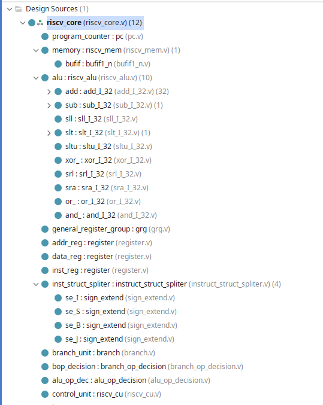

# RISC CPU by Verilog for study
- [RISC CPU by Verilog for study](#risc-cpu-by-verilog-for-study)
  - [usage](#usage)
  - [supported instruction(instruction detail see RISC-V-Reader)](#supported-instructioninstruction-detail-see-risc-v-reader)
  - [description for directory and file](#description-for-directory-and-file)
      - ["rv32i\_cpu\_Design\_Sources" is Design Sources(Verilog)](#rv32i_cpu_design_sources-is-design-sourcesverilog)
      - ["rv32i\_cpu\_Simulation\_Sources" is Simluation Sources(testbench)](#rv32i_cpu_simulation_sources-is-simluation-sourcestestbench)
      - ["machine\_code"](#machine_code)
  - [problems in design and solutions](#problems-in-design-and-solutions)
      - [如何设计控制器（Control Unit）](#如何设计控制器control-unit)
      - [下降沿修改CU状态机，上升沿更新寄存器](#下降沿修改cu状态机上升沿更新寄存器)
      - [设计CU状态机时，一段式状态机有问题，改用三段式状态机](#设计cu状态机时一段式状态机有问题改用三段式状态机)
      - [指令与数据------冯诺依曼结构](#指令与数据------冯诺依曼结构)

## usage
1. git-clone to your local computer 
```bash
git clone https://github.com/zengls3186428803/riscv-cpu.git
```
2. download vivado if you don't have, this is url for download vivado
```
https://www.xilinx.com/products/design-tools/vivado.html
```
3. (optional) download riscv-gnu-toolchain(please follow the README.md file for "riscv-gnu-toolchain")
```
https://github.com/riscv-collab/riscv-gnu-toolchain
```
4. (optional) you can modify machine/main.c, and remake final_hex.txt
```
make clean
make
```
5. modify rv32i_cpu_Design_Sources/riscv_mem file, change "/home/zengls/code/c/final_hex.txt" to /git-local-project-dir/machine_code/final_hex.txt
6. add rv32i_cpu_Design_Sources to Design Sources Directory in vivado,add rv32i_cpu_Simulation_Sources to Simulate Sources Directory
7. simulate (run tb.v) 

## supported instruction(instruction detail see RISC-V-Reader)
(https://www.cs.sfu.ca/~ashriram/Courses/CS295/assets/books/rvbook.pdf)
```
lui,auipc,
jal,jalr,
beq,bne,blt,bge,bltu,bgeu
lw
sw
addi,slti,sltiu,xori,ori,andi,slli,srli,srai
add,sub,sll.slt,sltu,xor,srl,sra,or,and
```
## description for directory and file
#### "rv32i_cpu_Design_Sources" is Design Sources(Verilog)
|filename|description|
|----|-------------|
add_I_32.v |      adder in ALU         
branch.v    |     branch unit          
or_I_32.v    |    or in ALU
riscv_core.v  |   Top file, assemble all other module
sll_I_32.v   | shift_left_logic in ALU
srl_I_32.v|    shift_right_logic
alu_op_decision.v    | decide to ues which op according to opcode
bufif1_n.v            |     ...
pc.v      |   program_counter
riscv_cu.v |    riscv-control-unit
slt_I_32.v  | set_less_than
sub_I_32.v| sub in ALU
and_I_32.v |          and in ALU 
grg.v       |         general_register_group(X0-X31)     
register.v   |    ...
riscv_mem.v   | riscv-memory that contains program(mathine code) and data
sltu_I_32.v  | set_less_than_unsigned
xor_I_32.v| xor in ALU
branch_op_decision.v  | decide to use which op according to opcode
instruct_struct_spliter.v | ...
riscv_alu.v  | arithmetic_logic_unit
sign_extend.v | ...
sra_I_32.v| shift_right_arithmetic


relationship of modules

#### "rv32i_cpu_Simulation_Sources" is Simluation Sources(testbench)
...
#### "machine_code"
|filename|description|
|----|-------------|
final_hex.txt|machine code in hex
init.s |initialize sp(stack pointer)
main.c |main c program that contains three function for test
makefile |...
process.py |used to generate final_hex.txt(detail see makefile)

## problems in design and solutions
#### 如何设计控制器（Control Unit）
首先，CU控制的是部件的使能（Write Enable）、数据的流向（Select）、(输出的使能【Read Enable】)、 (复位【reset】)
例如，取指阶段，要先把address regitser 的WE置1, 等address register 得到要访问的地址后，再打开内存的RE和data register的WE,等data register得到数据后，再打开instruction register 的WE,把数据写入instruction register
因此，CU是一个时序逻辑电路，部件的WE和Select是CU的状态，先做什么，再做什么就是状态的迁移。

#### 下降沿修改CU状态机，上升沿更新寄存器
例如addr_reg_WE=1，代表要往address regitser写入地址，为了使写入的时候addr_reg_WE已经为1，我选择在下降沿修改状态机，在上升沿更新寄存器

#### 设计CU状态机时，一段式状态机有问题，改用三段式状态机
有问题的一段式状态机见/resouces/cu.v
问题在：case----LOAD_INST_2（第90行左右）
```verilog
			`LOAD_INST_2: begin
				$display("LOAD_INST_2,opcode=%b",opcode);
				pc_WE <= 0;
				addr_reg_WE <= 0;
				data_reg_WE <= 0;
				inst_reg_WE <= 1;
				grg_WE <= 0;
				mem_RE <= 0;
				mem_WE <= 0;
				case(opcode)
					7'b0110011 : state <= `EXEC_R;
					7'b0010011 : state <= `EXEC_RI;
					7'b0100011 : state <= `EXEC_S_0;
					7'b0000011 : state <= `EXEC_L_0;
					7'b1100011 : state <= `EXEC_B;
					7'b1101111 : state <= `EXEC_JAL;
					7'b1100111 : state <= `EXEC_JALR;
					7'b0110111 : state <= `EXEC_LUI;
					7'b0010111 : state <= `EXEC_AUIPC;
				endcase
```
这里想要进行状态跳转，跳转依赖opcode,但这时，指令还没有写入inst_reg(指令寄存器),因此无法跳转，导致状态机在 LOAD_INST_2 状态停留两次。

修改后的三段式状态机在/rv32i_cpu_Design_Sources/riscv_cu.v

三段式状态机解决上述问题的原因在于：三段式状态机的状态跳转是组合逻辑，状态更新和输出是时序逻辑。
一般如果状态机不依赖外部输入，可用一段式，否则，优先使用三段式。

#### 指令与数据------冯诺依曼结构
我把代码和数据放到了同一个内存中了，代码在低地址空间,数据在高地址空间（由高地址向低地址生长的栈），因此初始的时候需要把sp指针指向高地址（例如我是在init.s文件中使用lui x2，0x3ff）